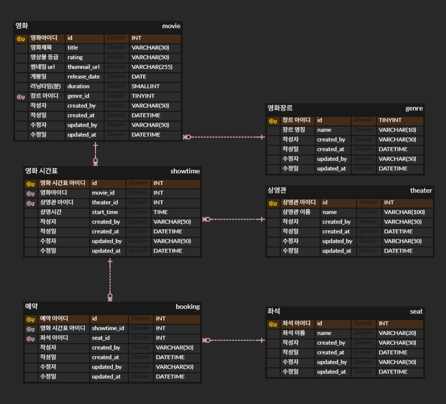
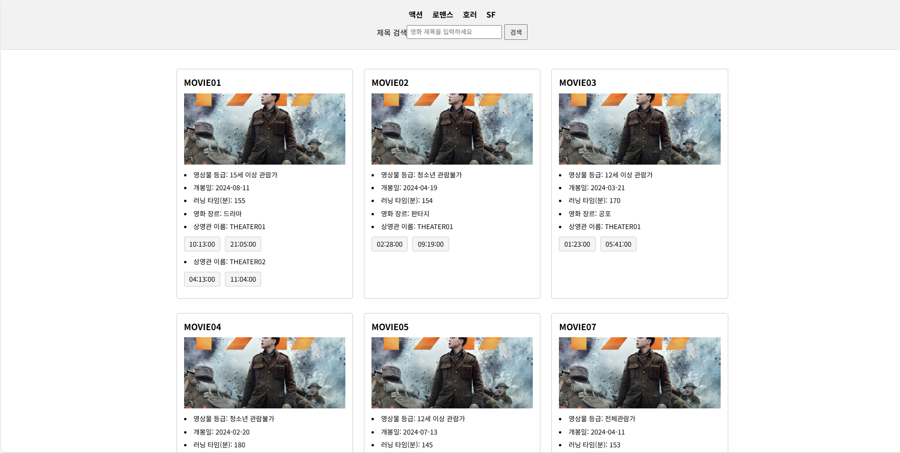

# Redis_Project

## 1. Multi Module
### 1. API 모듈 (Application, Presentation)   
- 클라이언트와 도메인 사이의 데이터를 전달하고, 사용자의 요청을 적절히 처리합니다.
- Application 에서 사용하는 RequestDto, ResponseDto 를 Presentation 계층이 사용할 수 있도록 하기 위해 하나의 모듈로 합쳤습니다. 
- 둘 사이에 DTO를 둘 수도 있겠지만, 더 복잡해질 것 같아 하나의 모듈로 합쳤습니다.  

### 2. Domain 모듈 (Domain)  
- 핵심 비즈니스 로직을 가지며, 순수한 비즈니스 로직만 가지고 있습니다. 
### 3. Infrastructure 모듈 (Infrastructure)  
- 외부 시스템과의 통신, 데이터 저장 및 처리를 전담합니다.  
- Application Layer에서 JPA를 사용한 Infrastructure Layer를 의존하지 않도록 하기 위해 
Domain 모듈에 정의해 놓은 Repository 인터페이스로 Adapter 를 구현하였습니다.  
## 2. Table Design

- 좌석은 모든 상영관이 똑같다고 가정합니다.
- 영화장르나 좌석은 추후에 변경 및 추가될 수 있다고 가정하고 테이블을 생성했습니다.
- 영상물 등급은 잘 변하지 않는 값인 것으로 보여, 테이블을 따로 생성하지 않았습니다.

## 3. API 
- 영화 상영 목록 조회 : [GET] /movie  

## 4. 예시 페이지

## 5. 부하 테스트 
[부하테스트](./부하테스트.md)

## 6. 분산락 테스트

아무것도 적용하지 않았을 때, 같은 영화 같은 좌석에 예매를 성공함

분산락을 적용한 이후 정상적으로 예약이 되는 것을 확인

### AOP 분산 락 테스트 결과 

### AOP 분산 락 (MultiLock) 테스트 결과 

### 함수형 분산 락 테스트 결과 

