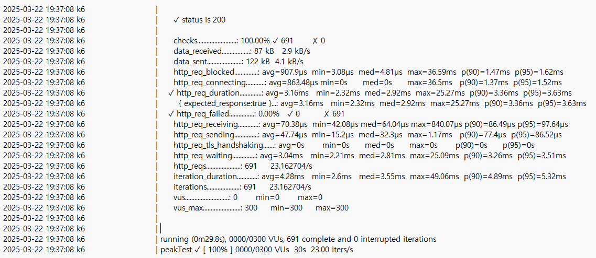
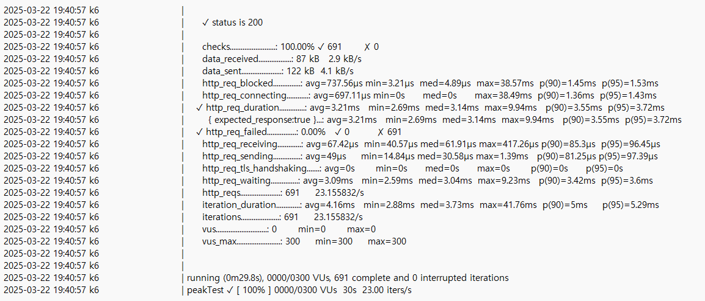
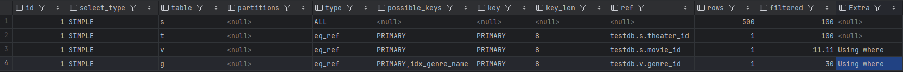
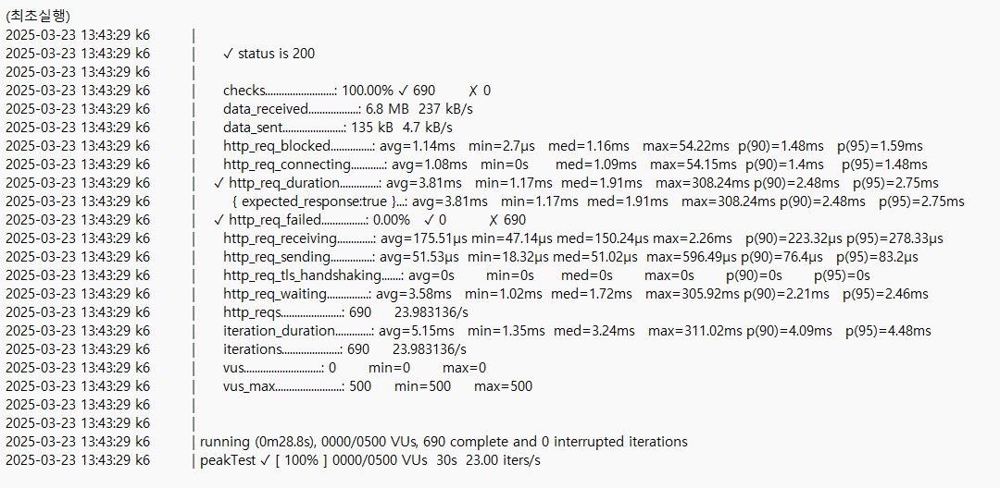
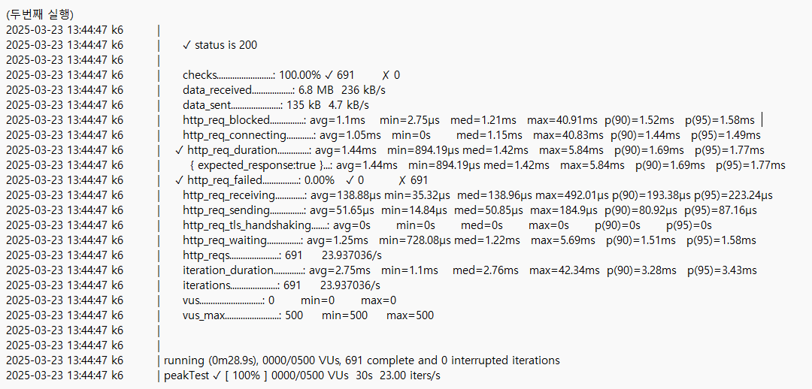
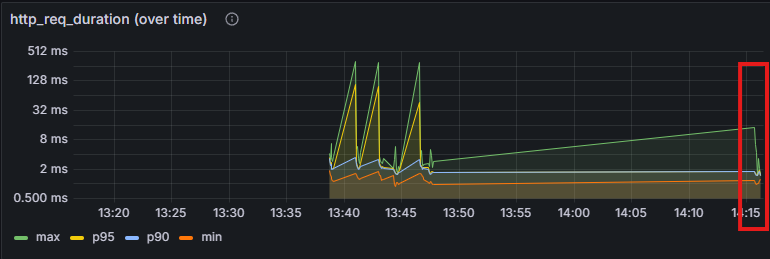

# 1. Index 적용 전

### 쿼리 (실제로 동작하는 쿼리)
```
SELECT s FROM ShowtimeEntity s  
join fetch s.theater  
left join fetch s.movie  
left join fetch s.movie.genre  
WHERE s.movie.releaseDate <= :today  
AND (:title IS NULL OR s.movie.title LIKE CONCAT('%', :title, '%'))  
AND s.movie.genre.name IN :genres  
```
### 실행 계획
- DAU : 100000 명
- 1일 총 접속 수 : 2 * DAU = 200000 명
- 1일 평균 RPS : 200000 / 86400 = 2.314
- 1일 최대 RPS : 2.314 * 10 = 23.14
- 테스트 시나리오 : 피크 RPS(10X)를 일정 시간 동안 유지

### 부하 테스트 결과 (스크린샷)


# 2. Index 적용 후

### 적용한 인덱스 DDL

```
alter table movie add index idx_movie_title(title);
alter table genre add index idx_genre_name(name);
```
### 실행 계획

### 부하 테스트 결과 (스크린샷)
- genre 만 인덱스 적용 했을 때

- genre, movie 에 인덱스 적용 했을 때


### 인덱싱 이후 차이가 크게 나타나지 않음  
 1. MYSQL은 B-Tree 가 기본이라서 like '%{title}%' 쿼리를 실행할 때 movie.title 인덱싱을 사용하지 않음  
 (like '{title}%' 쿼리는 실행됨)  
 2. 인덱스 효율은 보통 해당 컬럼의 카디널리티(중복도가 낮음)가 높을 수록 좋아짐  
 genre 테이블 같은 경우는 상대적으로 높은 카디널리티를 가지고 있지만, 행이 적은 소규모 테이블이라 풀스캔을 할 수도 있기 때문에 인덱싱의 효과가 없을 수 있음
 3. EXPLAIN 으로 확인 했을 때, PK 인덱싱은 사용했지만 idx_movie_title 과 idx_genre_name 인덱싱은 사용하지 않은 것으로 보임  
    추가로, moive 테이블인 3번째 row에 possible_keys에 추가한 idx_movie_title이 없음 (leading wildcard 로 검색했기 때문)
  


# 3. 로컬 Caching 적용 후

### 캐싱한 데이터의 종류
MovieRequestDto 를 key 값으로 캐싱  
인스턴스이기 때문에, equals()와 hashCode() 를 오버라이드 하여서 안에 값이 같다면 같은 객체로 인식하게 만듬

### 실행 계획

### 부하 테스트 결과 (스크린샷)


캐싱하고 난 다음 두번째 실행에서는 더 빠른 평균 응답속도를 가짐


빨간 부분이 캐싱하고 난 이후 부하테스트 한 부분
# 4. 분산 Caching 적용 후

### 캐싱한 데이터의 종류

### 실행 계획

### 부하 테스트 결과 (스크린샷)